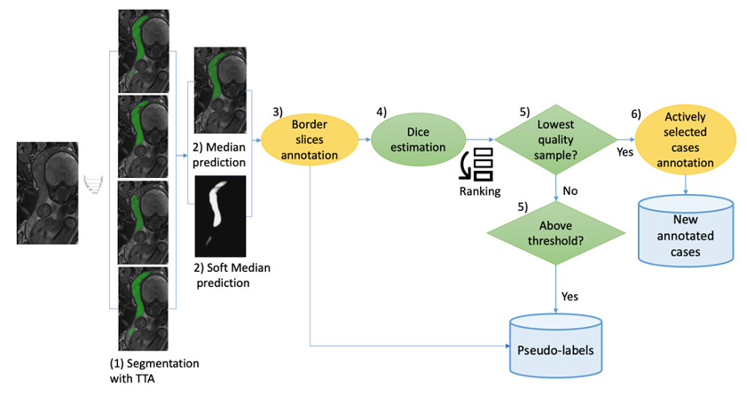
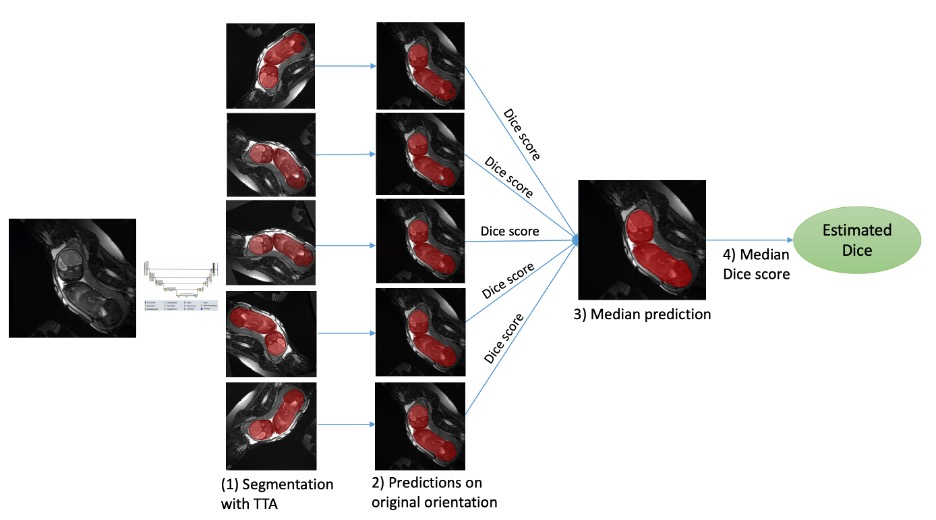

# Test-time augmentation-based quality estimation for self-training and active learning
This is the quality estimation code for the paper "Test-time augmentation-based active learning and
self-training for label-efficient segmentation" [1]. 
The code produces an "estimated Dice" measure for a given scan based on test-time-augmentations (TTA).
Following a ranking scheme on "estimated Dice" metric, it can then be used for samples selection in self-training and active learning iterations. Figure
1 illustrates the process of generating the new training datasets using TTA-based Dice quality estimation.

  Flow diagram of the combined active learning and self-training method. The
human annotation steps are marked in yellow. The steps are: 1) segmentation inference
with TTA is performed using the base network; 2) computation of a binary median
prediction with a threshold of 0.5 and the original soft median prediction; 3) manual
annotation of border slices; 4) TTA Dice estimation; 5) cases with the lowest estimated
Dice are selected for annotation, and from the rest of the cases pseudo labels are selected
above an estimated Dice threshold; 6) manual annotation of the actively selected cases.

First, TTA are applied during inference. For TTA we use flipping, rotation, transpose and contrast augmentations. 
Here is the TTA code: 

```
import numpy as np
from skimage.exposure import exposure
from scipy import ndimage


def flip(data, axes):
    for ax in axes:
        data = np.flip(data_, ax)
    return data

def predict_with_augmentation(data, model, overlap_factor, patch_shape, num_augments):
    """
    Applying inference with test-time-augmentations (TTA)
    :param data: input data
    :param model: segmentation model
    :param overlap_factor: overlap factor of the prediction
    :param patch_shape: Shape of the inference patch
    :param num_augments: number of augmentations
    :return: stacked TTA predictions
    """
    data_max = data.max()
    data_min = data.min()
    data = data.squeeze()
    order = 2
    predictions = []

    for _ in range(num_augments):
        #contrast augmentation
        val_range = data_max - data_min
        contrast_min_val = data_min + 0.10 * np.random.uniform(-1, 1) * val_range
        contrast_max_val = data_max + 0.10 * np.random.uniform(-1, 1) * val_range
        in_range = (contrast_min_val, contrast_max_val)
        curr_data = exposure.rescale_intensity(data, in_range=in_range, out_range='image')

        #rotate, flip, transpose
        rotate_factor = np.random.uniform(-30, 30)
        to_flip = np.arange(0, 3)[np.random.choice([True, False], size=3)]
        to_transpose = np.random.choice([True, False])
        curr_data = flip(curr_data, to_flip)
        if to_transpose:
            curr_data = curr_data.transpose([1, 0, 2])
        curr_data = ndimage.rotate(curr_data, rotate_factor, order=order, reshape=False)

        #apply prediction with overlap using your inference code
        curr_prediction = patch_wise_prediction(model=model, data=curr_data[np.newaxis, ...],
                                                overlap_factor=overlap_factor, patch_shape=patch_shape).squeeze()

        #apply inverse transformations
        curr_prediction = ndimage.rotate(curr_prediction, -rotate_factor, reshape=False)
        if to_transpose:
            curr_prediction = curr_prediction.transpose([1, 0, 2])
        curr_prediction = flip(curr_prediction, to_flip)

        predictions += [curr_prediction.squeeze()]

    stacked_preds = np.stack(predictions, axis=0)

    return stacked_preds
```
The quality estimation is obtained by computing the median Dice score between
the median prediction and each of the augmentation results [1-3]. A median
prediction is first assigned for each voxel, and then the estimated Dice score is
obtained by computing the median Dice score between the median and each one
of the augmentation results. Figure 2 illustrates the Dice score estimation.

  Flow diagram of the estimated Dice calculation.

If border slices information is provided (item 3 in Figure 1), the Dice estimation 
will be performed only on slices inside the structure of interest. Here is the code
for TTA Dice estimation:

```
import numpy as np

def dice(y_true, y_pred, smooth=1.):
    """
    Soft Dice function calculation
    :param y_true: truth mask
    :param y_pred: prediction mask
    :param smooth: smoothness parameter
    :return:
    """
    y_true_f = y_true.flatten() > 0
    y_pred_f = y_pred.flatten() > 0
    intersection = np.sum(y_true_f * y_pred_f)
    return (2. * intersection + smooth) / (np.sum(y_true_f) + np.sum(y_pred_f) + smooth)

def estimate_dice(tta_data, median_prediction, subject_id, cases_first_last_slices=None):
    """
    :param tta_data: loaded tta data. a list is expected.
    :param median_prediction: median tta prediction
    :param subject_id: subject id
    :param cases_first_last_slices: dictionary with start and end indices of the structure of interest with
    subject_id keys
    :return:
    """
    estimated_dice = {}
    for i in range(0, len(tta_data)):
        tta = tta_data[i]
        if cases_first_last_slices is not None:
            start_ind = cases_first_last_slices[subject_id]['start_ind']
            end_ind = cases_first_last_slices[subject_id]['end_ind']
            estimated_dice[i] = dice(median_prediction[:, :, start_ind:end_ind], tta[:, :, start_ind:end_ind])
        else:
            estimated_dice[i] = dice(median_prediction, tta)
    estimated_dice = np.median(list(estimated_dice.values()))
    return estimated_dice
```

References:

[1] Specktor-Fadida B, Levchakov A, Shonberger D, Ben-Sira L, Ben-Bashat D and Joskowicz L.
Test-time augmentation-based active learning and self-training. Accepted to MICCAI workshop
on Medical Image Learning with Limited and Noisy Data, 2023.

[2] Specktor-Fadida, B., Link-Sourani, D., Ferster-Kveller, S., Ben-Sira, L., Miller,
E., Ben-Bashat, D. & Joskowicz, L. A bootstrap self-training method for sequence
transfer: state-of-the-art placenta segmentation in fetal MRI. Uncertainty For Safe
Utilization Of Machine Learning In Medical Imaging, And Perinatal Imaging, Placental
And Preterm Image Analysis: 3rd International Workshop, UNSURE 2021,
And 6th International Workshop, PIPPI 2021, Held In Conjunction With MICCAI
2021, Strasbourg, France, October 1, 2021, Proceedings 3. pp. 189-199 (2021)

[3] Specktor-Fadida B, Link-Sourani D, Rabinovich A, Miller E, Levchakov A, Avisdris N, Ben-Sira L, Hierch L, Joskowicz L and Ben-Bashat D. 
Deep Learning-based Segmentation of Whole-Body Fetal MRI and Fetal Weight Estimation: Assessing Performance, Repeatability and Reproducibility. Accepted to European Radiology.